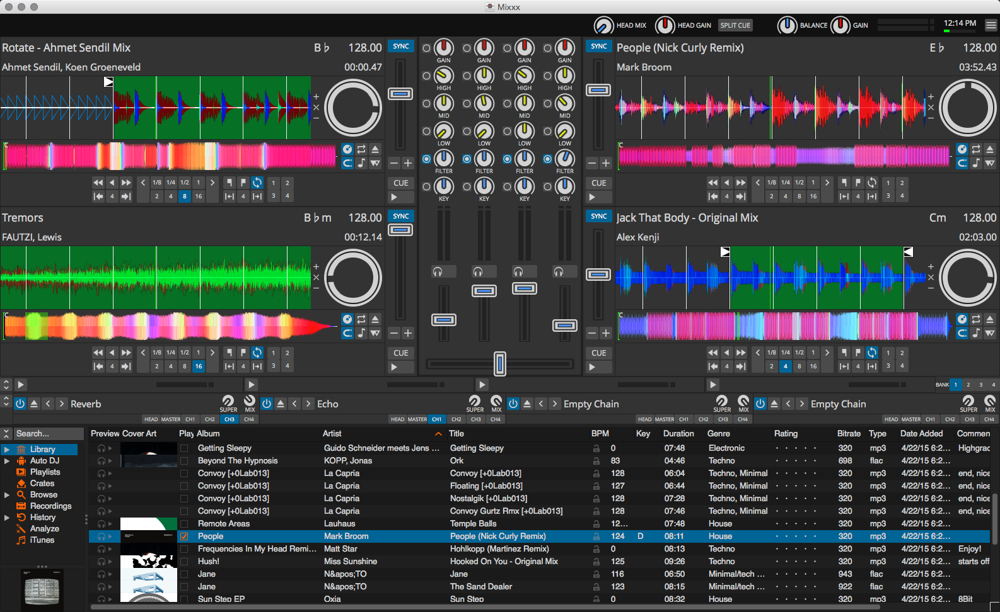

# Modern JavaScripting a MIDI controller

Abstract: Blogpost summarizing the challenges of creating a flexible and customizable MIDI controller mapping for Mixxx targeting multiple Novation Launchpad grid controllers.

Keywords: JavaScript, MIDI, Mixxx, ES6 modules, Babel, Flow

## Intro

Serato and Traktor are the two leading digital DJ software on the market, and I wonder if you have heard about [Mixxx](https://www.mixxx.org/)? It serves exactly the same purpose as its commercial counterparts but with a moral advantage: it's free and open-source.



Creating a successful community-driven project in the pro-audio software industry has a specific difficulty: not only you have to write software that meets high standards in terms of UX and stability, you also have to support a range of hardware devices to convert the crowd. See, there's not much use of a live performance software without the ability to control it and you can expect the target audience consisting of DJs and electronic musicians to be fond of their expensive hardware and simply choose software that support their arsenal and not the other way around.

Now imagine you want to start a community-driven pro-audio project, and you want it to support a lot of devices, what can you do? One way is to go and try to appeal to the manufacturers for lending you a piece of each of their more popular models accompanied with instructions how to develop them (programming manuals are often publicly available fortunately). Then even if the particular manufacturer is kind enough to lend you hardware without any legal contract, it becomes your responsibility to distribute it among all your contributors, whom you must trust enough or bind them by a contract. This needs a well organized community process, a lot of effort, and most likely a legal person. What if you have neither of these? You could go with a simpler, libre approach: get your users involved in the development process, so anyone who owns a device can program it and share with the community. Mixxx chose this path.

Well then, let the members of the community write their own controller mappings for Mixxx! What would be a perfect platform for this job? How would you execute these mappings? Mixxx, quite unsurprisingly, is written in C++. You probably know that it is a complex system programming language meant for creating performance critical applications. I can also tell you that it's damn hard, so it's not ideal for non-programmers to start hacking a DJ software as a hobby. 

If only we could use a 
- simple (so it's easy to learn), 
- interpreted (no complicated build process please!), 
- sandboxed (prevents bringing the whole application down), 
- dynamic (easy build process once more)

language such as JavaScript! The smart people working Mixxx of course realized this, so as you would expect from the title, that's what we use to program MIDI controllers in Mixxx.

## Fighting the Hideous Monster

A further reason why JavaScript was chosen is that it's simply the easiest solution. Mixxx was written with [Qt](https://www.qt.io/), a popular native application framework, which is already bundled with a JavaScript interpreter for the purpose of extending its declarative GUI markup language called QML.
The current version of Mixxx is built on Qt 4.8 having a god knows what make and version of JS interpreter, which I will call Hideous Monster from now on.
Hideous Monster is claimed to be ES5 compliant, however that doesn't hold for its parser, throwing errors on e.g. `x.default` or `{ final: 'x' }`. First, I hadn't understood, so I did some digging to find out the following: In ES3, keywords and future-reserved keywords can be neither *member expression literal*s nor *property literals*, a restriction lifted in ES5, in addition to removing a lot of future-reserved keywords specified in ES3, like `final`, `abstract` or `public`. It seems that the parser remained in the ES3 era. 

Wait a moment, the title suggests that you use modern JavaScript! How does using ES3 or ES5 justify that claim? Well, of course it doesn't, and I don't do that. Instead I transpile my code with Babel to the target platform and use a module bundler, pretty much the same way a front-end developer would do for the browser! Going back to ES3, as Babel generates noncompliant code from certain language features I'd rather use, e.g. default exports or for-of-loops, I had to work around it. Fortunately I could find [transforms](https://github.com/szdavid92/mixxx-launchpad/blob/master/.babelrc) for the formerly mentioned property naming rules, greatly mitigating the issue. However, removed future-reserved keywords as identifiers remains an unresolved problem as of now still. (It only turned up in one case so far).

## Use ~~next~~ current generation JavaScript, today.

Today, JavaScript (ECMAScript 6) is a pretty decent language. Modularized, with statically resolved imports; an overwhelming amount of tools for code analysis and transformation; and nice language features overall. The community provides a wide range of packages under permissive licenses. I decided in the very beginning that I want to make use of all this.

My motives behind writing this blogpost First, One of the motives behind writing this very blogpost is to convince anyone who wishes to right a controller script to do the same as me: use modern tools available to the JavaScript community

The first major concern is using **modern JavaScript** - ES6. I already mentioned Babel in the previous section. By using it I am able to write code in the current generation of JavaScript. 

Second in line is **modularization**, which enables me to split my project into separate files and makes me able to use packages from npm like one the downright necessary collection utility modules (lodash or underscore). My files and the external dependencies are bundled up with a module bundler into a single script file the Hideous Monster can interpret.

Finally, I added a **linter** from the start to enforce consistent coding style and prevent simple mistakes. Later, I also decided to use a **static type checking** tool, Flow, which adds.

There is nothing special about this so far, it is similar to a conventional front end JavaScript application setup! Sadly however, the Mixxx community haven't started using these language tools yet, as you can see if you [visit the repo](https://github.com/mixxxdj/mixxx/tree/master/res/controllers), making this project a pioneer in utility model. 

## Rolling up everything

I initially used Browserify in conjuction with its [Babel plugin](https://github.com/babel/babelify) to bundle my ES6 modules into a a nice fat standalone module which can be interpreted by the Hideous Monster. It was a perfectly working solution, and exactly that boring as everybody is already using Browserify successfully for years to transfer CommonJS code back to the stone age. 

In case you don't know how this stuff works, here's a brief intro. Browserify knows nothing about ES2015, and just as little about ES6 modules, as it was created to bundle CommonJS modules. So before letting Browserify 'link' our modules, we have to cheat and run a Babel transform on each of our files which (among other things) rewrites ES6 modules into the CommonJS format, so that it can be handled by the bundler. Of course we lose the benefits coming with ES6 modules that arise as a consequence of the fact that imports and exports are resolved ahead-of-time. Whereas this is not possible with CommonJS (a though job at least), an ES6-capable bundler could simply identify and eliminate certain chunks of dead code automatically - concretely those manifesting in the form of unused exports - by simply looking at the dependency graph. This is commonly known as 'tree-shaking', which in addition to being an incorrect name for the problem<sup>*</sup>, sounds silly too. Fortunately there is a new module bundler on the block called Rollup that does this, so I gave it a go. 

Rewriting the scripts to use Rollup was straightforward, however I felt the whole process's justifiability somewhat hindered after I realized that there are only a handful of ES6 modules out on npm. The source of this situation is rooted in platform support of course, as Node.js doesn't support ES6 modules yet, and it [appeared in browsers](https://medium.com/dev-channel/es6-modules-in-chrome-canary-m60-ba588dfb8ab7) only recently. This isn't a game stopper for front end packages where dependents use a compilation toolchain anyways so it ES6 modules can be easily integrated. The problem relevant for the server though, where common development practice disregards module bundling and generally any kind of ahead-of-time code manipulation. This ambivalence is clearly reflected on the landscape of npm packages<sup>**</sup>, as shown below.

Legend:
 - ✅: ES6 by default
 - ⚠️: ES6 not the default distribution, or some other quirk
 - ❌: no ES6

**Utility** *(these are used both server and client side)*:

- [⚠️][lodash] lodash 
- [⚠️][async] async
- [⚠️][underscore] underscore 

**HTTP, DB and messaging** *(mainly on the server)*:

- ❌ express 
- ❌ redis 
- ❌ socket.io 
- ❌ request 
- ❌ mongoose 

**Front end frameworks**:

- ✅ Angular 
- ✅ Ember
- ❌ React
- ✅ Vue
 

[lodash]: https://www.npmjs.com/package/lodash-es
[async]: https://www.npmjs.com/package/underscore-es
[underscore]: https://www.npmjs.com/package/underscore-es

 In the end of day, for my Launchpad script only my own hand-written, organic code and lodash could be handled OOTB by Rollup, while I had to use a [CommonJS to ES6 transformer plugin](https://github.com/rollup/rollup-plugin-commonjs) for the rest.

<sub><sup>*</sup>It originates from LISP, where it was used for figuring out dead-code dynamically by evaluating all possible execution paths, so if Browserify had some kind of dead-code elimination for CommonJS, that usage would be a better fit the term.</sub>

<sub><sup>**</sup>Checked in May 2017</sub>
## Static types with Flow

I started with plain ES6 and later on decided to add Flow definitions for sake of experimentation. Flow is a static type checker and a language extension for JavaScript that unlike TypeScript only requires transpilation to the extent of eradicating type annotations from the source code. Type annotations are similar to comments in a sense that they have absolutely no impact on the runtime behavior of the code. Instead they help the type checker in essence by serving as marker with which you can label values as instances of intended types. Here's an [example][flow-example-type]. They can be incrementally added as you rediscover your code with your new torch. Beware as you will find many skeletons in the closet! Going back to type annotations, as I mentioned they don't even make it into the code, and more interestingly neither do they cause code to be generated by the transpiler. They are just [deleted][flow-example], period. Contrary to TypeScript that always had stuff requiring code generation, Flow has no intention of dynamically extending the language. There is power in elegance: this property ensures that Flow code behaves the same way as the equivalent JavaScript without type annotations. You can actually choose to add them in form of comments, so it doesn't even require a intermediate step. The fact that the transpilation remains optional also means that type checking remains a separate process, decoupled from transpilation. Imagine Flow as a linter on steroids.

Flow made me think a lot. Static types forced me to approach my source code differently. As soon as I started adding type annotations I began to realize that my application was badly structured. Why? A lot of previously hidden dependencies appeared between the source files in the form of type imports (if you have a type definition in another source file you have to import it, such as you import an object) and it was a mess, so I had to reorganize my code. I also realized that I can generalize a lot by introducing superclasses. There is still much left to be desired, for example the preset builder remains very dynamic despite all my efforts.


[flow-example-type]: https://flow.org/try/#0PQKgBAAgZgNg9gdzCYAoVBLAdgFwKYBOUAhgMZ5gBCxBA1sQEYwUDeYwwYAyhjDAJ5hs+ImTwBnADRgAkmFpZEYAFwBKVGDAMatABQIAFsRzKwAfnE4C2AOarTANzgYAJgG5UAX3TDCJcmAAKsS8AOrENjaMzGAsGmAIEcG8uvZgTq4e3qikMMTi4mAAglgYALbEMLHZufmFACJwNmB4AB74WC6FJeWVQmUADsxleLiFyTDhkdF40tR0M7HxOCGTETZ4LoHlEqZYAK5lDIQemvGkcFiWBPukOHAEYKlLmpri+wOEqfGaOAYY4gAdCswutNtsRoUALxgAAMpzA3jOmm0dH0RhM5mutjSGRcL1eGCgT0MxjAUIpYAOfFUsXYnHEBjg+xg+OOCQx5Jh1Jg0mOpGI+3EFH2nTwUGwmy53JZMB+rwuVzgzEB8BsugA5KE4HAoABCDXqV6IlowYUE40cAAkAFFWp87jaCAQHvLNIrxMq8KqmujjMC4ABVAafAgC4WpWkcMA4fgDOCme7B0MAYXyeHlSMR8XiiRsE1Sjmc+LixoA1GW-gDgasphstjtxAjvNlmDgwC4mqZGs1uXgkD3Uh5OzZAXmC6ph01Aai9JPUCOZzpdFZ9nhJ-TsA5Kq4F9PZ7pRS5xZKXPPFweeef98utTr9WBtbqDfOgA

[flow-example]: https://goo.gl/ulf3cE

## Taming the Mixxx APIs 

The two main APIs that are exposed to you when you are working on Mixxx controller scripts are the [MIDI and Engine APIs](https://mixxx.org/wiki/doku.php/midi_scripting). You use the MIDI API to talk to the MIDI device, while Engine let's you observe and modify Mixxx's internals. I made some effort to create a wrapper for both APIs, taking more time with the Engine API wrapper which is almost in a state where it can be separated from this project to be used by others, although it was not my original intention to do so. I consider the biggest advantage for both API wrappers over using their native counterparts is the event notification system. The native APIs are a mess, with undocumented and unconventional (the worst!) behavior, which you are very likely to misuse and leak resources when e.g. reassigning event handlers. The wrapper greatly simplifies correct usage with EventEmitters that should be familiar from Node.js. There are stuff that are not yet implemented yet, like enforcing correct usage for all of Mixxx's controls. For example, we could prevent modifying read-only controls. Unlike the Engine API wrapper, the MIDI API wrapper can't be externalized in its current form as it is specialized for Launchpad.

Mixxx's 'module loading' interface also requires you to supply an XML file containing meta data about the controller and the script, and a list of your MIDI listener bindings. Instead of writing this file by hand, which is pretty long and hard to maintain, I generate it with the [EJS](http://www.embeddedjs.com/) templating tool created for HTML, but seems to handle XML just as well.

```xml
<?xml version='1.0' encoding='utf-8'?>
<MixxxControllerPreset mixxxVersion="1.11+" schemaVersion="1">
    <info>
        <name><%= manufacturer %> <%= device %></name>
        <author><%= author %></author>
        <description><%= description %></description>
        <forums><%= homepage %></forums>
    </info>
    <controller id="<%= manufacturer %> <%= device %>">
        <scriptfiles>
            <file functionprefix="<%= global %>" filename="<%= manufacturer %>-<%= device %>-scripts.js"/>
        </scriptfiles>
        <controls>
            <% buttons.forEach(function (button) { %><control>
                <group>[Master]</group>
                <key><%= global %>.__midi_<%= button.status %>_<%= button.midino %></key>
                <status><%= button.status %></status>
                <midino><%= button.midino %></midino>
                <options>
                    <script-binding/>
                </options>
            </control><% }) %>
        </controls>
        <outputs/>
    </controller>
</MixxxControllerPreset>
```

## Conclusion

If you are interested in the project itself, you can find it on GitHub by the name [szdavid92/mixxx-launchpad](https://github.com/szdavid92/mixxx-launchpad). There is a comprehensive user manual making it easy to start out. I hope that all I've written down here might turn useful for someone who wants to create a new controller mapping for Mixxx and I hope they follow my footsteps in doing so. Furthermore, I am inclined to put more work in the API wrappers, so if you would like to use them, I could make the effort and complete them so they can be separated into an external package you can use. Thanks for reading, and happy coding!
